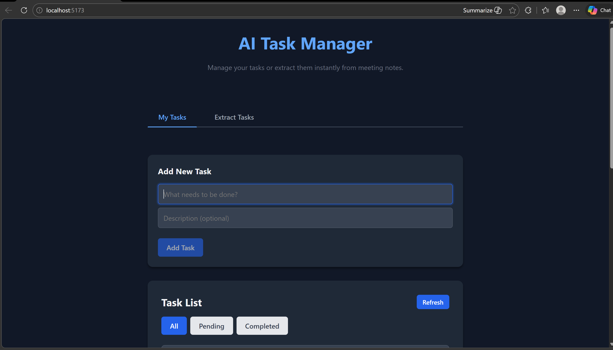
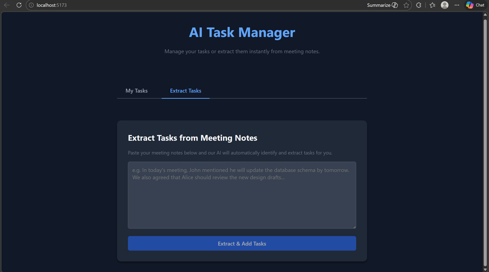
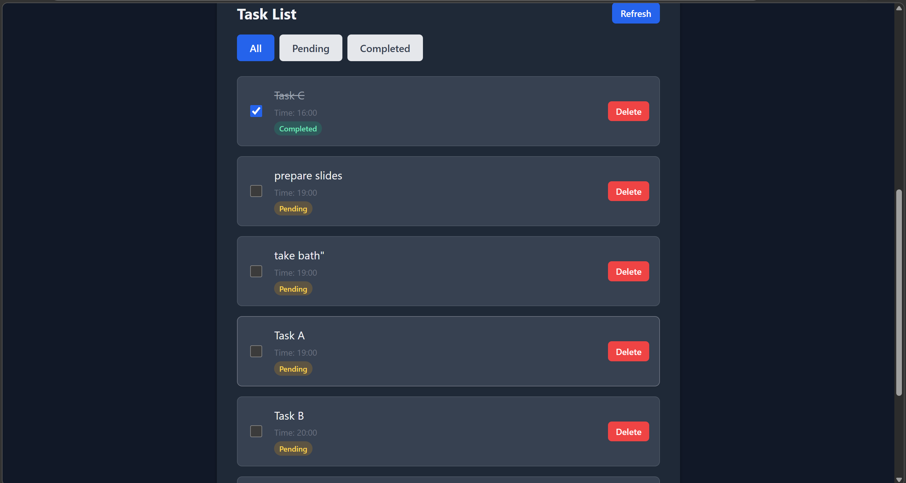

# AI Meeting Task Manager

An AI-powered task management application that converts unstructured meeting notes into structured tasks and allows users to manage them through a simple dashboard.

The system uses an AI model to extract actionable tasks from meeting text and automatically organize them for tracking and completion.

---

## Features

* Extract tasks automatically from meeting notes using AI
* Create tasks manually
* Assign optional time to tasks
* View tasks sorted by time
* Mark tasks as completed
* Delete tasks
* Filter tasks (All / Pending / Completed)

---

## Tech Stack

**Frontend**

* React
* Vite

**Backend**

* Flask REST API

**Database**

* SQLite (Relational Database)

**AI Extraction**

* LLM-based task extraction service

---

## Architecture

```
React Frontend
      │
      ▼
Flask REST API
      │
      ▼
Task Service Layer
      │
      ▼
SQLite Database
      │
      ▼
AI Extraction Service
```

The frontend communicates with the backend using REST APIs.
The backend handles business logic, AI task extraction, and data persistence.

---

## API Endpoints

| Method | Endpoint             | Description                       |
| ------ | -------------------- | --------------------------------- |
| GET    | `/tasks`             | Retrieve all tasks sorted by time |
| POST   | `/tasks`             | Create a new task                 |
| PATCH  | `/tasks/{id}/status` | Update task status                |
| DELETE | `/tasks/{id}`        | Delete a task                     |
| POST   | `/tasks/extract`     | Extract tasks from meeting notes  |
| GET    | `/health`            | Backend health check              |

---

## Installation

### Backend Setup

```bash
cd backend
pip install -r requirements.txt
python -m flask --app app run
```

Backend runs at:

```
http://127.0.0.1:5000
```

---

### Frontend Setup

```bash
cd frontend
npm install
npm run dev
```

Frontend runs at:

```
http://localhost:5173
```

---

## Screenshots


### Dashboard



### Task Extraction



### Task List (Scheduled Times)



---

## AI Task Extraction

The system uses a language model to convert meeting notes into structured tasks.

Example input:

```
Prepare slides for tomorrow
Finish backend implementation
Schedule client meeting
```

Example extracted tasks:

```
Prepare slides
Finish backend implementation
Schedule client meeting
```

If a task does not contain time information, the backend assigns a default time slot so tasks remain ordered.

---

## Future Improvements

* User authentication
* Role-based task assignment
* Email notifications for pending tasks
* Calendar integration
* Task priority levels
